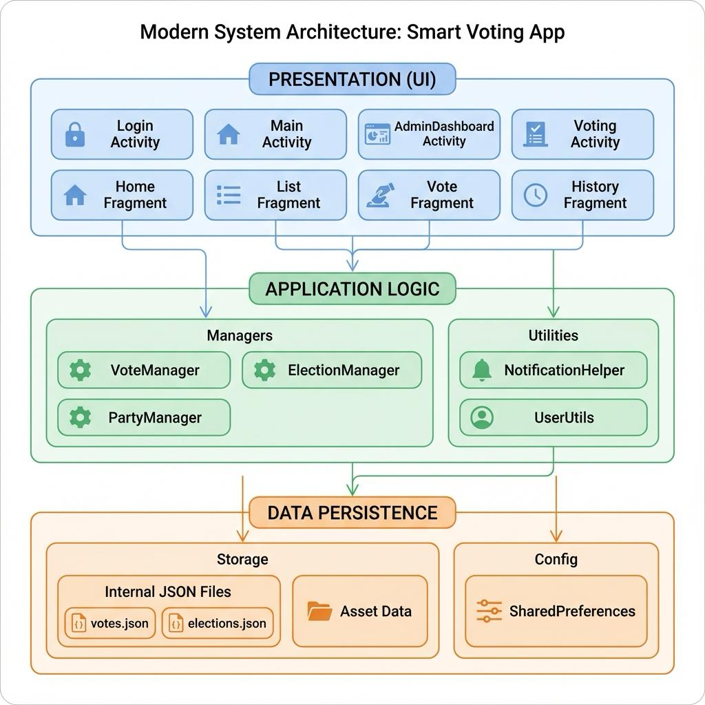
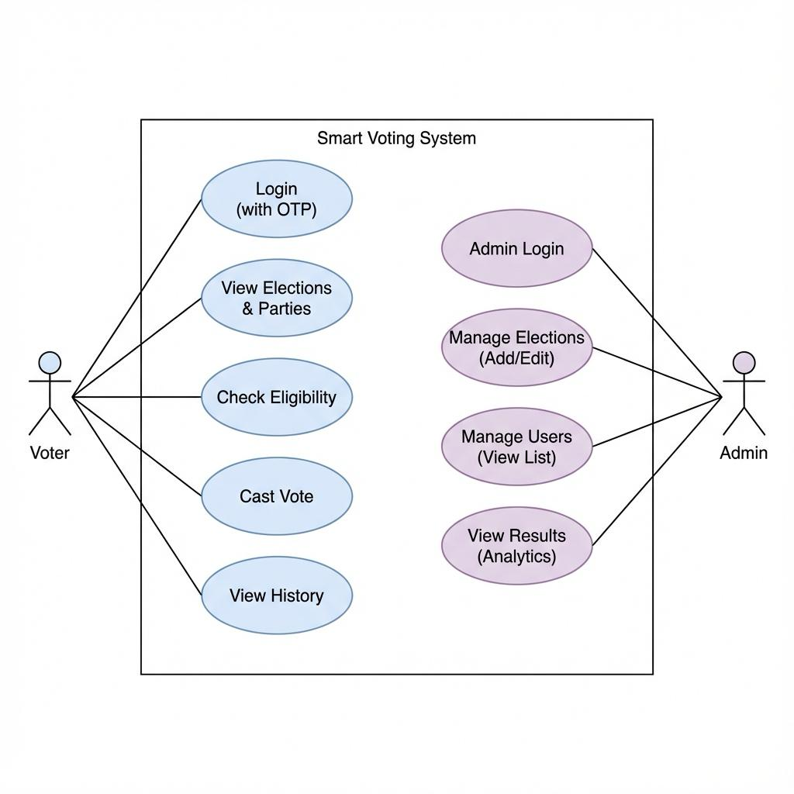

# Smart Voting App Web Portal

## 🗳️ Project Description
The **Smart Voting App Web Portal** is the official landing page and information hub for the Smart Voting mobile application. It is designed to modernize the democratic process by providing a secure, transparent, and efficient platform for voting information.

This web portal serves as a gateway for users to download the Android application, access project documentation, and learn about the team and technology behind this revolutionary e-voting solution.

### 🌟 Key Features
- **Modern & Responsive Design**: Built with a mobile-first approach using React and Tailwind CSS, ensuring a seamless experience across all devices.
- **Direct APK Download**: Easy access to the latest version of the Smart Voting App for Android.
- **Project Resources**: One-click downloads for the Project Report (PDF) and Presentation (PPTX).
- **Team Showcase**: A dedicated section highlighting the project lead, developers, and academic guidance.
- **Aesthetic UI**: Features glassmorphism effects, smooth animations, and a professional color palette (Emerald & Slate).

### 📸 Screenshots & Diagrams

#### App Interface
| Dashboard | Login |
|:---:|:---:|
|  |  |

#### System Architecture


#### Workflows
| Flowchart | Use Case |
|:---:|:---:|
|  |  |

---

## 🛠️ Technology Stack
- **Frontend Framework**: [React](https://react.dev/) (v19)
- **Build Tool**: [Vite](https://vitejs.dev/)
- **Styling**: [Tailwind CSS](https://tailwindcss.com/)
- **Icons**: SVG & Emoji-based icons
- **Deployment**: Vercel / GitHub Pages (Ready)

---

## 🚀 Creation & Setup Guide (How to Run Locally)

Follow these steps to set up the project on your local machine:

### Prerequisites
- Node.js (v18 or higher recommended)
- npm (comes with Node.js)

### 1. Clone the Repository
```bash
git clone https://github.com/YOUR_USERNAME/smart-voting-web.git
cd smart-voting-web
```

### 2. Install Dependencies
Install all the necessary libraries and tools defined in `package.json`.
```bash
npm install
```
*or if using yarn:*
```bash
yarn install
```

### 3. Run Development Server
Start the local server to view the website in your browser.
```bash
npm run dev
```
The site will be available at: `http://localhost:5173/`

### 4. Build for Production
To create an optimized build for deployment (creates a `dist` folder):
```bash
npm run build
```

---

## 📂 Project Structure
```
smart-voting-web/
├── public/                 # Static assets (APK, PDF, PPTX)
├── src/
│   ├── components/         # Reusable UI components
│   │   ├── Hero.jsx        # Landing section
│   │   ├── Features.jsx    # Key features grid
│   │   ├── About.jsx       # Project, Guide & Resources
│   │   ├── Team.jsx        # Team members
│   │   └── Footer.jsx      # Copyright & links
│   ├── App.jsx             # Main application layout
│   ├── index.css           # Global styles & Tailwind directives
│   └── main.jsx            # Entry point
├── tailwind.config.js      # Tailwind CSS configuration
└── vite.config.js          # Vite configuration
```

---

## 👥 Team
**Project Lead & Developer**: Naveengouda M K
**Guide**: Prof. [Guide Name]
**Department**: Computer Science & Engineering, [College Name]

---

## 📄 License
This project is for educational and showcase purposes.
All rights reserved © 2026 SmartVoting App.
